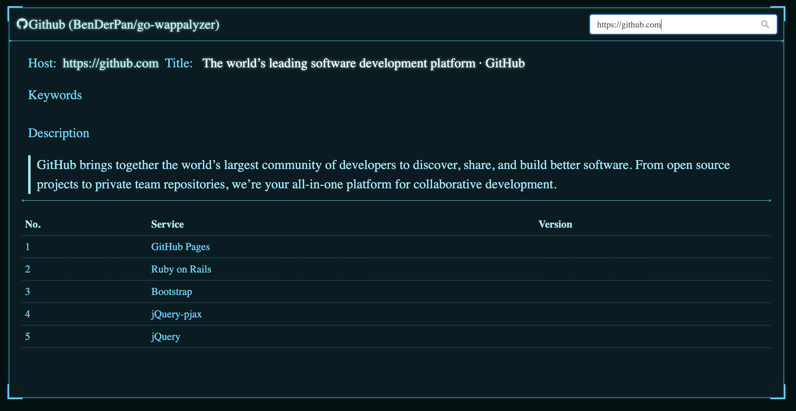
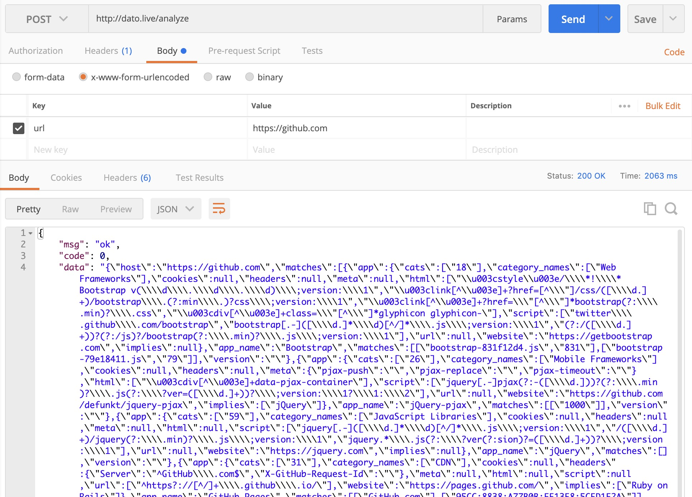

# go-wappalyzer
Go implement Wappalyzer. with web ui support.

# Quick start
* [Online Demo - Out of service now!!! Expired of my VPS](http://dato.live/) this may be slow, the server is too fuck but really cheap :)

# Web ui screenshot



# usage
```
Usage of gowappalyzer:
  -apps string
        app definition file. (default "apps.json")
  -crawl int
        links to follow from the root page (default 0)
  -host string
        single host to test
  -hosts string
        filename with hosts, one host per line.
  -listen string
        Web server listen address (default "0.0.0.0:8080")
  -output string
        output file (default "data.json")
  -type string
        run type, standalone - single tool model, web - web server model (default "standalone")
  -update
        update apps file
  -verbose
        show verbose message (default true)
  -worker int
        number of concurrent worker (default 4)

```
# update apps.json
* Command `./gowappalyzer -update`

# run web
* Command `./gowappalyzer -type web -listen 0.0.0.0:8080`
* Visit [http://localhost:8080](http://localhost:8080)
* API, PostMan example



# example output for : https://github.com

```json
{
    "host":"https://github.com",
    "matches":[
        {
            "app":{
                "cats":[
                    "26"
                ],
                "category_names":[
                    "Mobile Frameworks"
                ],
                "cookies":null,
                "headers":null,
                "meta":{
                    "pjax-push":"",
                    "pjax-replace":"",
                    "pjax-timeout":""
                },
                "html":[
                    "<div[^>]+data-pjax-container"
                ],
                "script":[
                    "jquery[.-]pjax(?:-([\d.]))?(?:\.min)?\.js(?:\?ver=([\d.]+))?\;version:\1?\1:\2"
                ],
                "url":null,
                "website":"https://github.com/defunkt/jquery-pjax",
                "implies":[
                    "jQuery"
                ]
            },
            "app_name":"jQuery-pjax",
            "matches":[
                [
                    "1000"
                ]
            ],
            "version":""
        },
        {
            "app":{
                "cats":[
                    "59"
                ],
                "category_names":[
                    "JavaScript Libraries"
                ],
                "cookies":null,
                "headers":null,
                "meta":null,
                "html":null,
                "script":[
                    "jquery[.-]([\d.]*\d)[^/]*\.js\;version:\1",
                    "/([\d.]+)/jquery(?:\.min)?\.js\;version:\1",
                    "jquery.*\.js(?:\?ver(?:sion)?=([\d.]+))?\;version:\1"
                ],
                "url":null,
                "website":"https://jquery.com",
                "implies":null
            },
            "app_name":"jQuery",
            "matches":[

            ],
            "version":""
        },
        {
            "app":{
                "cats":[
                    "18"
                ],
                "category_names":[
                    "Web Frameworks"
                ],
                "cookies":null,
                "headers":null,
                "meta":null,
                "html":[
                    "<style>/\*!\* Bootstrap v(\d\.\d\.\d)\;version:\1",
                    "<link[^>]+?href=[^"]/css/([\d.]+)/bootstrap\.(?:min\.)?css\;version:\1",
                    "<link[^>]+?href="[^"]*bootstrap(?:\.min)?\.css",
                    "<div[^>]+class="[^"]*glyphicon glyphicon-"
                ],
                "script":[
                    "twitter\.github\.com/bootstrap",
                    "bootstrap[.-]([\d.]*\d)[^/]*\.js\;version:\1",
                    "(?:/([\d.]+))?(?:/js)?/bootstrap(?:\.min)?\.js\;version:\1"
                ],
                "url":null,
                "website":"https://getbootstrap.com",
                "implies":null
            },
            "app_name":"Bootstrap",
            "matches":[
                [
                    "bootstrap-831f12d4.js",
                    "831"
                ],
                [
                    "bootstrap-445c13e9.js",
                    "445"
                ]
            ],
            "version":""
        },
        {
            "app":{
                "cats":[
                    "31"
                ],
                "category_names":[
                    "CDN"
                ],
                "cookies":null,
                "headers":{
                    "Server":"^GitHub\.com$",
                    "X-GitHub-Request-Id":""
                },
                "meta":null,
                "html":null,
                "script":null,
                "url":[
                    "^https?://[^/]+\.github\.io/"
                ],
                "website":"https://pages.github.com/",
                "implies":[
                    "Ruby on Rails"
                ]
            },
            "app_name":"GitHub Pages",
            "matches":[
                [
                    "GitHub.com"
                ],
                [
                    "2B43:37FE:FC823D:16349AF:5CEA59FE"
                ]
            ],
            "version":""
        },
        {
            "app":{
                "cats":[
                    "18"
                ],
                "category_names":[
                    "Web Frameworks"
                ],
                "cookies":{
                    "_session_id":"\;confidence:75"
                },
                "headers":{
                    "Server":"mod_(?:rails|rack)",
                    "X-Powered-By":"mod_(?:rails|rack)"
                },
                "meta":{
                    "csrf-param":"^authenticity_token$\;confidence:50"
                },
                "html":null,
                "script":[
                    "/assets/application-[a-z\d]{32}/\.js\;confidence:50"
                ],
                "url":null,
                "website":"https://rubyonrails.org",
                "implies":[
                    "Ruby"
                ]
            },
            "app_name":"Ruby on Rails",
            "matches":[

            ],
            "version":""
        }
    ],
    "duration":1950171035,
    "error":"",
    "web_title":"The world’s leading software development platform · GitHub",
    "web_keywords":"",
    "web_desc":"GitHub brings together the world’s largest community of developers to discover, share, and build better software. From open source projects to private team repositories, we’re your all-in-one platform for collaborative development."
}
```

# thanks

* [arwes/arwes](https://github.com/arwes/arwes) for great react ui components.
* [webanalyze](https://github.com/rverton/webanalyze) for great implementation of go version [AliasIO/Wappalyzer](https://github.com/AliasIO/Wappalyzer)
* [mjibson/esc](https://github.com/mjibson/esc) for great embeds files into go programs and provides http.FileSystem interfaces to them.
